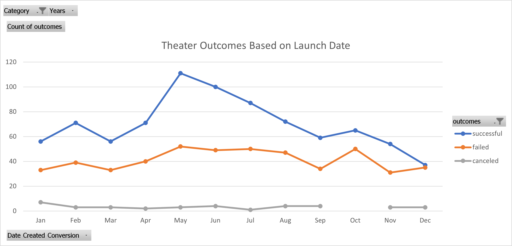
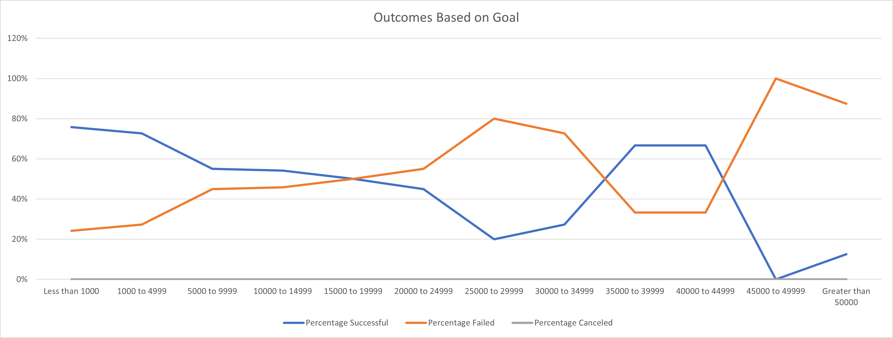

# Theater Kickstarter Analysis using Excel

## More than four thousand Kickstarter campaigns were analyzed to find trends that differentiate successful and failed campaigns.

### A playwright is looking for information on the relationship between the start date and funding goals of crowdfunding campaigns and their success rate.

## Analysis and Challenges

### Analysis of Outcomes Based on Launch Date

A pivot table was used to find the relationship between launch date and campaign outcome. 
The table was filtered to only include campaigns in the theater category. The table contained the count of successful, failed, and canceled campaigns separated by month. The output of this table was then charted.

### Analysis of Outcomes Based on Goals

The COUNTIFS function was utilized to make a table of the number of successful, failed, and canceled campaigns separated into bins based on their funding goals.  This table was then used to find the percentage of successful, failed, and canceled campaigns.  A chart of outcome percentage vs funding goal was created.

### Challenges and Difficulties Encountered

Possible challenges could have arisen from incomplete or missing data.  Analysis would have been much more difficult if there were not enough theater campaigns to make meaningful conclusions or if there were missing values in the dataset. 

## Results

May has dramatically more successful campaigns (111) than most months. Additionally, May has an average number of failed campaigns indicating a higher percentage of successful campaigns not just an uptick of campaigns in general.  The second and third best months for successful campaigns follow immediately after in June (100) and  July (87) before falling back to average levels in August.  

Campaigns with funding goals between zero and fifteen thousand were mostly successful.  This trend flips with campaign goals between 20k and 35k becoming predominately failures. Successful campaigns become the majority again for the 35k to 45k range. Finally, goals 45K+ were highly unsuccessful.  Also noteworthy is the fact that campaign goals 0 to 5k and 35k to 45k were successful more than  2/3rds of the time.  Conversely goals in the ranges of 25k to 35k and 45k and beyond were unsuccessful in much higher percentages than average.

This dataset is limited due to its smaller size and because the most recent data point is from 2017.

Other avenues of investigation could be graphs of outcome vs country or outcome vs time between launch and deadline.

